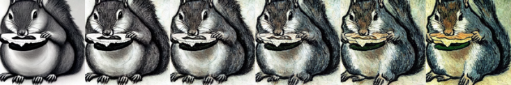
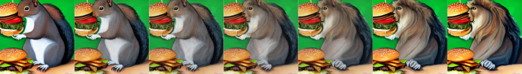
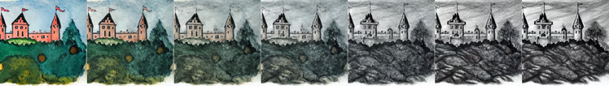

<h1 align="center">Continuous Style Control</h1>
<p align="center"><strong>Image morphing using Stable Diffusion</strong></p>
<br/>
<div align="center"></img>
</div>
<h2>About</h2>

Unlike text-conditioned models like Stable Diffusion, common unconditional
GANs such as StyleGAN allow for style control of the generated images by manipulating
the input latent code. It is possible to discover latent directions that
correlate with certain characteristics, such as hair color, skin tone, lighting, and
pose (in the particular example of faces). Since the latent space is continuous, it
is also possible to smoothly interpolate between these factors of variation while
preserving the identity of the generated image. It would be interesting to see if
such interpolation can also be achieved using diffusion models.
<br><br>
Our attempt to achieve this uses a combination of CLIP embedding interpolation and attention map interpolation (based on <a href="https://prompt-to-prompt.github.io/">Prompt-to-Prompt</a>).
We also tried comparing it to another technique based on <a href="https://github.com/ml-research/semantic-image-editing">Semantic Guidance</a>. These methods are then used to interpolate between text prompts, which allows continuous style control (eg. between prompts like "a red car" and "a green car"), but also more complex morphs (eg. "a squirrel eating a burger" and "a lion eating a burger").
<br><br>
Our findings are described in our [final report](report.pdf).

<h2>Try it out yourself</h2>

To experiment with our code and see how it works, you can take a look at the Jupyter Notebook. The [CSC-all-in-one.ipynb](CSC-all-in-one.ipynb) notebook can simply be uploaded to Google Colab and should just work without any extra setup. You can also find this notebook <a href="https://colab.research.google.com/drive/1TU4SkCyWEjO-nZOs4q4PW0FDy_TrRstK?usp=sharing">here</a>. 

Our main / best method (CLIP+Attention interpolation) has been implemented in the `AttentionFullInterpolation` controller. This controller wraps around any [Prompt-to-Prompt edit controller](https://github.com/google/prompt-to-prompt#prompt-edits) and interpolates by a given factor between the original output and the edited output.

Example: 

```python
# We interpolate between these two prompts: 
prompts = ["A painting of a squirrel eating a burger",
           "A painting of a lion eating a burger"]  

# Define any edit controller using Prompt-to-Prompt:
lb = LocalBlend(prompts, [("squirrel","lion")])
controller_edit = AttentionReplace(prompts, NUM_DIFFUSION_STEPS,
                                   cross_replace_steps=.8, self_replace_steps=0.4, local_blend=lb)

# The interpolation controller needs a third placeholder prompt.
# The prompt itself does not matter as it will be replaced by the interpolated CLIP embedding of the first two prompts.
prompts += [""]

# interpolate 50%
p = 0.5

# Define the interpolation controller, which wraps around the edit controller.
# You can also use local_blend in the interpolation controller, just like in any other Prompt-to-Prompt edit.
controller_interp = AttentionFullInterpolate(p, prompts, NUM_DIFFUSION_STEPS, controller=controller_edit,
                                             cross_replace_steps=0.9, self_replace_steps=0.8, local_blend=lb)

# run & display result
run_and_display(prompts, controller_interp, run_baseline=False, clip_alpha=p, result_only=True)

```

To run AttentionFullInterpolate, a GPU with 16GB+ VRAM is required.

<h2>A few results </h2>
"A charcoal drawing of a squirrel eating a burger"  &rarr;  "A painting by Van Gogh of a squirrel eating a burger"
</img>
<br>
"A painting of a squirrel eating a burger"  &rarr;  "A painting of a lion eating a burger"
</img>
<br>
"A portrait of a Roman Emperor" &rarr; "A portrait of a Chinese Empress"
</img>
<br>
"A children's painting of a large castle on a hill in the distance" &rarr; "A drawing of a large fantasy castle on a hill in the distance"
</img>
<br>
"A realistic painting of a white boy" &rarr; "A realistic painting of a black girl"
</img>


<h2>Credits</h2>

This project was developed by Jonathan Swinnen, Patrick Eppensteiner and Yannick Biehl for the 'Generative Visual Models' seminar at ETH Zürich during the spring semester of 2023. 
<br> We would like to thank Prof. Thomas Hofmann and his team of TA's for their support, without whom this project would not have been possible.
<br><br>
The code & notebook is heavily based on the one provided in the 'Prompt-to-Prompt' project. <br> You can find their work here:
https://prompt-to-prompt.github.io/
<br><br>
The alternative semantic guidance technique was taken from the 'semantic-image-editing' project. <br> You can find their work here:
https://github.com/ml-research/semantic-image-editing
